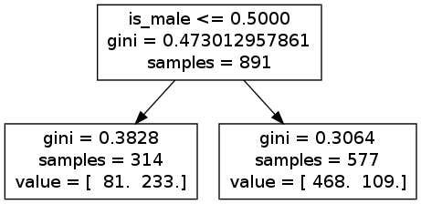

kaggle_titanic_ipythonnotebook_boilerplate
==========================================

Boilerplate example using IPython Notebook to solve simplest (sex-field only) Titanic challenge for Kaggle (this will get you started wtih the Kaggle competition)

This is the Titanic challenge:
http://www.kaggle.com/c/titanic-gettingStarted/

For a longer and far more in-depth analysis using Pandas see: 
http://nbviewer.ipython.org/urls/raw.github.com/agconti/kaggle-titanic/master/Titanic.ipynb

You *must download* the data from Kaggle to run this Notebook.

This Notebook replicates this example but using Python and an IPython Notebook:
http://www.kaggle.com/c/titanic-gettingStarted/details/getting-started-with-excel

Run the Notebook using:

    $ ipython notebook --pylab=inline  # start the Notebook

Go to the webbrowser, open the "kaggle_titanic_sexcolumnonly_decision_tree" example. Work through it, generate the csv output file at the end and upload to Kaggle. You can also view the generated decision tree in-line. The decision tree that you visualise will look like:

You will probably need the dependencies too:

    $ pip install -r requirements.txt  # uses pip to get all the Python bits

Please note that I can't help you setup your machine, you'll have to figure that out yourself. Feel free to send me a Pull Request if you have improvements to the documentation. This tutorial *cannot* say any more about how to solve the Kaggle competition as that would be against the rules.
